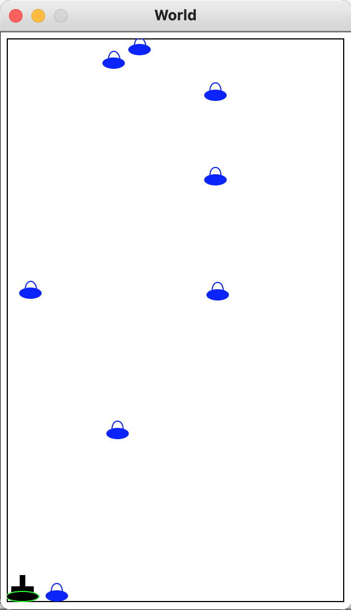

# Space Invaders

This is my final project for the EDX' course **[How to Code: Simple Data](https://www.edx.org/course/how-to-code-simple-data)** made with Racket Programming Language.

This game was the amalgamation of everything I learned in the aforementioned course:

- How to think and design computer programs using a systematic design approach.
- How to do domain-analysis by mapping real-world concepts (domain) to data.
- Designing and implementing interactive world programs (mostly video-games).
- Using recursion and self-referential data definitions for arbitrarly large data such as lists and binary trees.
- How to manage a program growing complexity by using helper functions.
- Having a baptism of fire in a LISP-based language (parenthesis go brrrrrrr.....((((((((())))))))) ).



### Pre-Requisites

You need [Racket and DrRacket IDE](https://download.racket-lang.org/) installed in your machine in order to compile and run the game.

### Instructions to Run

Open **space-invaders-starter.rkt** file with DrRacket and click  to execute the tests and get the REPL ready to execute the game.

Go to the REPL window, in the bottom side of DrRacket and write the following function call to start the game:

```racket
(main G1)
```

**Have fun!**

